# 图书馆管理系统
## 规划
后面考虑打包成docker镜像。

## `.env`放进`.gitigore`了
## 数据库使用
使用`Redis`存储`session`
使用`MySQL`存储用户和借书信息

## 数据库架构图 (Database ER Diagram)

```mermaid
erDiagram
    %% 用户表 (推断自代码逻辑)
    User {
        uint ID PK "主键"
        string Username "用户名 (Unique)"
        string Password "加密后的密码"
        string Role "角色: 'admin' 或 'user'"
        datetime CreatedAt
        datetime UpdatedAt
        datetime DeletedAt "软删除字段"
    }

    %% 图书表 (来自 models.Book)
    Book {
        uint ID PK "主键"
        string Title "书名"
        string Author "作者"
        string Summary "简介"
        string CoverPath "封面图片路径 (uploads/...)"
        int InitialStock "初始入库数量"
        int TotalStock "总库存"
        int Stock "当前剩余可借库存"
        datetime CreatedAt
        datetime UpdatedAt
    }

    %% 借阅记录表 (来自 models.BorrowRecord)
    BorrowRecord {
        uint ID PK "主键"
        uint UserID FK "关联用户ID"
        uint BookID FK "关联图书ID"
        string Status "状态: 'borrowed' / 'returned'"
        datetime BorrowDate "借出时间"
        datetime ReturnDate "归还时间 (可为空)"
        datetime CreatedAt
        datetime UpdatedAt
        datetime DeletedAt
    }

    %% 关系定义
    User ||--o{ BorrowRecord : "发起借阅 (1对多)"
    Book ||--o{ BorrowRecord : "被借阅 (1对多)"
```

## API 接口功能全景图 (API Functional Map)
> 鉴权组件为`session`

```mermaid
graph TB
    %% 定义样式类
    classDef public fill:#e1f5fe,stroke:#01579b,stroke-width:2px;
    classDef user fill:#fff9c4,stroke:#fbc02d,stroke-width:2px;
    classDef admin fill:#ffcdd2,stroke:#c62828,stroke-width:2px,stroke-dasharray: 5 5;

    %% 图例
    subgraph Legend [图例说明]
        direction LR
        L1(🟢 公开接口):::public
        L2(🟡 需登录权限):::user
        L3(🔴 需管理员权限):::admin
    end

    %% 1. 认证模块
    subgraph AuthModule [🔐 认证模块 /api/auth]
        direction TB
        
        Login["POST /login<br/>(用户登录)<br/>--------------<br/>📥 <b>Body (JSON):</b><br/>- username<br/>- password<br/>--------------<br/>📤 <b>Response:</b><br/>Set-Cookie: mysession"]:::public
        
        Register["POST /register<br/>(用户注册)<br/>--------------<br/>📥 <b>Body (JSON):</b><br/>- username (3-20位)<br/>- password (min 6位)"]:::public
        
        Logout["POST /logout<br/>(退出登录)<br/>--------------<br/>⚠️ 需 Cookie<br/>此接口位于 /api/logout"]:::user
    end

    %% 2. 图书模块
    subgraph BookModule [📚 图书模块 /api/books]
        direction TB
        
        ListBooks["GET /<br/>(获取图书列表)<br/>--------------<br/>📥 <b>Query Params:</b><br/>- title (模糊)<br/>- author (模糊)<br/>- summary (模糊)"]:::public
        
        CreateBook["POST /<br/>(新增图书)<br/>--------------<br/>⚠️ <b>Type: multipart/form-data</b><br/>📥 <b>FormData:</b><br/>- title (required)<br/>- author (required)<br/>- initial_stock (int)<br/>- summary<br/>- cover (File/Image)"]:::admin
        
        UpdateBook["PUT /{id}<br/>(修改图书)<br/>--------------<br/>⚠️ <b>Type: multipart/form-data</b><br/>📥 <b>FormData:</b><br/>- title<br/>- author<br/>- summary<br/>- stock (现有库存)<br/>- total_stock (总库存)<br/>- cover (可选更新)"]:::admin
        
        DeleteBook["DELETE /{id}<br/>(删除图书)<br/>--------------<br/>⚠️ 逻辑限制:<br/>如果该书有未还记录<br/>返回 409 Conflict"]:::admin
    end

    %% 3. 借阅模块
    subgraph BorrowModule [🤝 借阅模块 /api/borrows]
        direction TB
        
        Borrow["POST /<br/>(借阅图书)<br/>--------------<br/>📥 <b>Body (JSON):</b><br/>- id (图书ID)<br/>--------------<br/>🔄 逻辑: 库存 -1"]:::user
        
        Return["POST /return<br/>(归还图书)<br/>--------------<br/>📥 <b>Body (JSON):</b><br/>- id (图书ID)<br/>--------------<br/>🔄 逻辑: 库存 +1<br/>更新归还时间"]:::user
    end

    %% 布局连接（仅为了视觉对齐，无实际逻辑含义）
    Legend ~~~ AuthModule
    AuthModule ~~~ BookModule
    BookModule ~~~ BorrowModule
```
